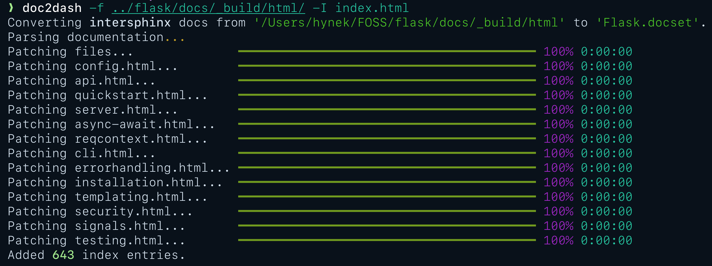

# Create Docsets for Dash.app and Friends

<!-- begin-short -->

*doc2dash* is an extensible [Documentation Set](https://developer.apple.com/library/archive/documentation/DeveloperTools/Conceptual/Documentation_Sets/010-Overview_of_Documentation_Sets/docset_overview.html#//apple_ref/doc/uid/TP40005266-CH13-SW6) (*docset*) generator that helps you to have documentation for all your favorite APIs in [*Dash.app*-compatible](https://kapeli.com/dash/) API browsers.

An API browser is an application that runs locally on your computer and allows you to search various API docs by pressing a key combination and starting to type (I have bound it to Alt-Space bar and can't write code without it).

The most common ones – [*Dash.app*](https://kapeli.com/dash) (macOS) and [*Zeal*](https://zealdocs.org) (Windows and Linux) – come with **many** docsets out of the box, but they can never offer you docsets for *every* package you'll ever use.
This is where *doc2dash* comes in:
It takes your offline documentation and converts it into an indexed format that API browsers can read and search (very fast!).

Currently it supports all known *intersphinx*-based documentation systems like [*Sphinx*](https://www.sphinx-doc.org/), [*pydoctor*](https://github.com/twisted/pydoctor), or [*MkDocs*](https://www.mkdocs.org) (with [*mkdocstrings*](https://mkdocstrings.github.io)).
While *doc2dash* is a Python project, the support is **not** limited to Python-related formats.

It's also extendable: [**you** can write your own parser](https://doc2dash.readthedocs.io/en/latest/extending/)!

## Project Information

- **License**: [MIT](https://github.com/hynek/doc2dash/blob/main/LICENSE)
- **PyPI**: <https://pypi.org/project/doc2dash/>
- **Source Code**: <https://github.com/hynek/doc2dash>
- **Documentation**: <https://doc2dash.rtfd.io/>
- **Changelog**: <https://github.com/hynek/doc2dash/blob/main/CHANGELOG.md>
- **Supported Python Versions**: 3.8 and later (check the changelog for past releases that support _much_ older Python versions)
- **Platforms**: pre-compiled **binaries** for **Linux**, **macOS**, and **Windows** available; also runs on everything that runs Python
