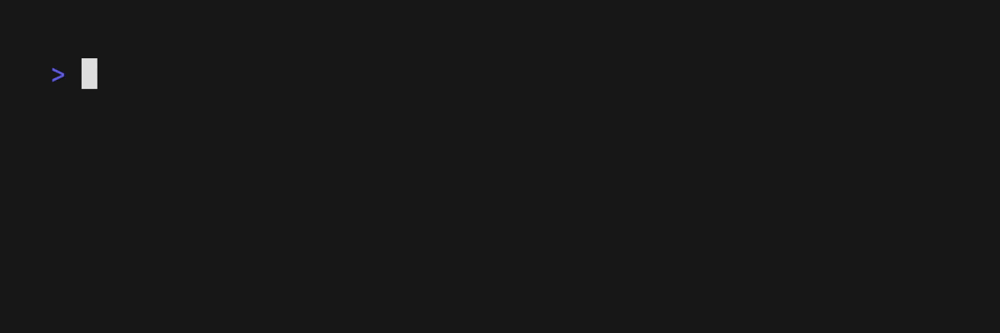

# Create Docsets for Dash and Friends

[](https://doc2dash.hynek.me/)
[](https://github.com/hynek/doc2dash/blob/main/LICENSE)
[](https://github.com/hynek/homebrew-tap)
[](https://pypi.org/project/doc2dash/)

<!-- begin-short -->

*doc2dash* is an extensible [Documentation Set](https://developer.apple.com/library/archive/documentation/DeveloperTools/Conceptual/Documentation_Sets/010-Overview_of_Documentation_Sets/docset_overview.html#//apple_ref/doc/uid/TP40005266-CH13-SW6) (*docset*) generator that helps you to have documentation for all your favorite APIs in [Dash-compatible](https://kapeli.com/dash/) API browsers.

An API browser is an application that runs locally on your computer and allows you to search various API docs by pressing a key combination and starting to type (I have bound it to ⌥Space bar and can’t write code without it).

The most common ones – [Dash](https://kapeli.com/dash) (macOS) and [Zeal](https://zealdocs.org) (Windows and Linux) – come with **many** docsets out of the box, but they can never offer you docsets for *every* package you’ll ever use.
This is where *doc2dash* comes in:
It takes your offline documentation and converts it into an indexed format that API browsers can read and search (very fast!).

Currently it supports all known *intersphinx*-based documentation systems like [Sphinx](https://www.sphinx-doc.org/), [*pydoctor*](https://github.com/twisted/pydoctor), or [MkDocs](https://www.mkdocs.org) (with [*mkdocstrings*](https://mkdocstrings.github.io)).
While *doc2dash* is a Python project, the support is **not** limited to Python-related formats.

It’s also extendable: [**you** can write your own parser](https://doc2dash.hynek.me/en/latest/extending/)!




## Quickstart

The fastest way to get started is installing *doc2dash* from our [Homebrew tap](https://github.com/hynek/homebrew-tap):

```console
$ brew install hynek/tap/doc2dash
```

> [!NOTE]
> If you can’t – or won’t – use [Homebrew](https://brew.sh), check out our [installation instructions](https://doc2dash.hynek.me/en/latest/installation/) for alternatives.

Then point *doc2dash* at a directory containing **built** [*intersphinx*-compatible](https://doc2dash.hynek.me/en/stable/formats/) documentation:

```console
$ doc2dash directory/to/documentation
```

You should see an output like in the video above and find an appropriately named *docset* in the current directory.
That’s it – you can add it to Dash or Zeal!

---

*doc2dash* has many more features and options – make sure to check out the [usage](https://doc2dash.hynek.me/en/stable/usage/) for more details.
A full how-to is [available too](https://doc2dash.hynek.me/en/latest/how-to/).


## Project Links

- [**Homebrew Tap**](https://github.com/hynek/homebrew-tap)
- [**Pre-compiled Binaries**](https://github.com/hynek/doc2dash/releases)
- [**PyPI**](https://pypi.org/project/doc2dash/)
- [**Changelog**](https://github.com/hynek/doc2dash/blob/main/CHANGELOG.md)
- [**Documentation**](https://doc2dash.hynek.me/)
- [**Funding**](https://hynek.me/say-thanks/)


## Credits

*doc2dash* is maintained by Hynek Schlawack and released under the [MIT](https://github.com/hynek/doc2dash/blob/main/LICENSE) license.

The development is kindly supported by my employer [Variomedia AG](https://www.variomedia.de/) and all my amazing [GitHub Sponsors](https://github.com/sponsors/hynek).
